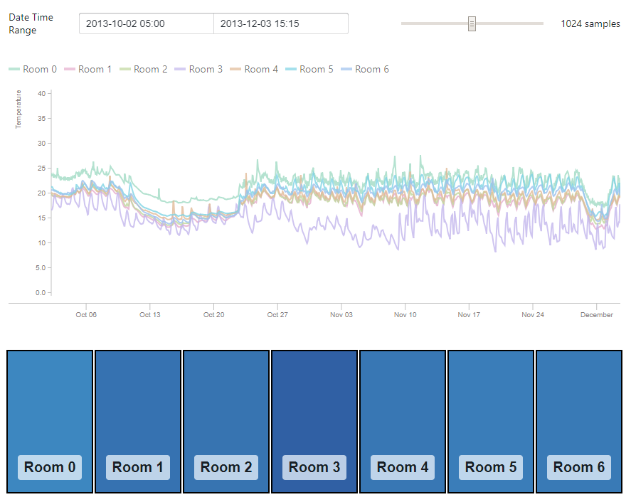
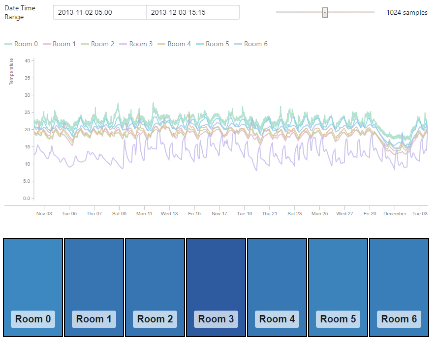
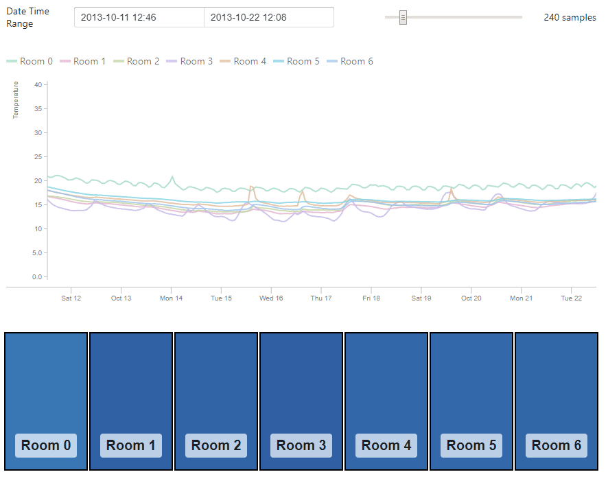
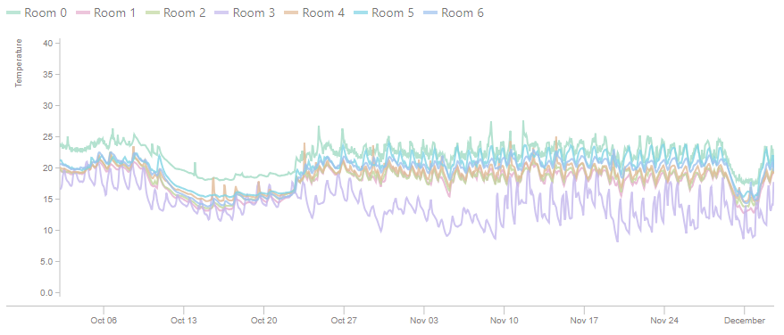
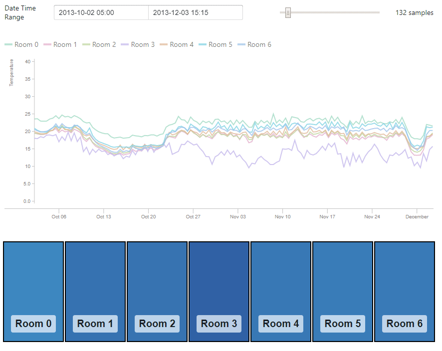
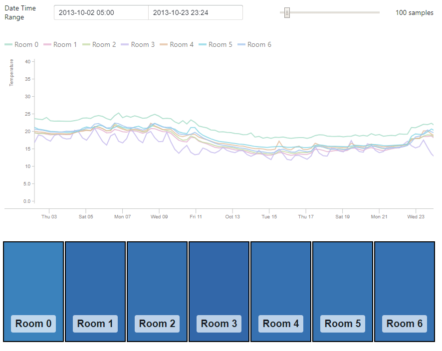
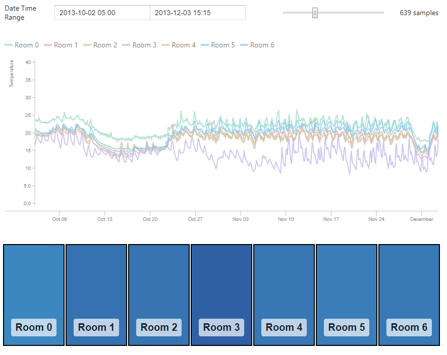

# SmartTemp


A smart temperature monitoring dashboard made in Meteor and React.

## Getting start

Make sure you have meteor 1.8 installed

Clone this repository by running

```bash
git clone --recurse-submodules git@github.com:FausticSun/SmartTemp.git
```

Install npm packages by running

```bash
cd SmartTemp
npm i
```

Finally run the server by running

```bash
meteor run --production
```

## Functionalities

### Start and End Time fields

For users to explicitly change start and stop times by typing


### "Number of Samples" slider

For users to change the number of points per line to draw in the graph


### Temperature graph

Shows multiple lines, one line per room


### Graph synchronization

Sync with Start/End times and number of samples

See "Number of Samples" slider and Graph interaction

### Graph interaction

Zoom by clicking and dragging, pan by holding down ctrl and dragging


### Room color change

Room color show average temperature of time period, darker blue for colder temperature


### Room toggle

Clicking on room toggles the following:

- Temperature graph for room is shown/hidden
- Temperature color on room is shown/hidden


